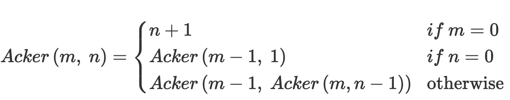

# LAB02 - The Ackermann Function

Ackermann's Function is a fun recursive function we'll implement in this lab.

## Due Date

This assignment is due by midnight, Saturday, February 18, 2023.

## Background

Chapter 2, Exercise 26

Consider the following recursive definition



This function, called _Ackermann's Function_, is of interest because it grows rapidly with respect to the sizes of _m_ and _n_. In this lab you will implement this function.

### Advanced Reading

- General > Files > Class Materials > Setting Up WSL for CSC232.pdf
- Chapter 2 Recursion: The Mirrors

## Objectives

Upon successful completion of this lab, the student has gained experience with

- declaring functions
- identifying and implementing base case(s)
- identifying and implementing recursive case(s)

## Tasks

1. Task 1 - Declare the function
2. Task 2 - Implement the base case
3. Task 3 - Implement recursive case

### Task 1

1. Open the `csc232.h` header file and locate the `TODO`.
2. Name the function `Acker`; its return type must be declared to be of type `size_t` and the parameters must be declared as type `size_t`
3. When you have completed this task, toggle the `SKIP_TESTING_TASK_1` macro from `TRUE` to `FALSE`.
4. Build and execute the `test_task1` target to test your solution (or run `ctest`)
5. When all the tests for this task pass, commit and push your changes to GitHub.

### Task 2

1. Open the `csc232.cpp` source file and locate the `TODO`.
2. Implement the `Acker` function base case(s).
3. When you have completed this task, toggle the `SKIP_TESTING_TASK_2` macro from `TRUE` to `FALSE`.
4. Build and execute the `test_task2` target to test your solution (or run `ctest`).
5. When all the tests for this task pass, commit and push your changes to GitHub.

### Task 3

1. Implement the `Acker` function recursive case(s).
2. When you have completed this task, toggle the `SKIP_TESTING_TASK_2` macro from `TRUE` to `FALSE`.
3. Build and execute the `test_task2` target to test your solution (or run `ctest`).
4. When all the tests for this task pass, commit and push your changes to GitHub.

## Submission Details

Before submitting your assignment, be sure you have pushed all your changes to GitHub. If this is the first time you're pushing your changes, the push command will look like:

```bash
git push -u origin develop
```

If you've already set up remote tracking (using the `-u origin develop` switch), then all you need to do is type:

```bash
git push
```

As usual, prior to submitting your assignment on Blackboard, be sure that you have committed and pushed your final changes to GitHub. Once your final changes have been pushed, create a pull request that seeks to merge the changes in your `develop` branch into your `trunk` branch. Once your pull request has been created, submit the URL of your assignment _repository_ (i.e., _not_ the URL of the pull request) on the Teams Assignment. Please note: the timestamp of the submission on Teams is used to assess any late penalties if and when warranted, _not_ the date/time you create your pull request. **No exceptions will be granted for this oversight**.

### Grading Rubric

This assignment is worth **3 points**.

| Criteria           | Exceeds Expectations         | Meets Expectations                  | Below Expectations                  | Failure                                        |
|--------------------|------------------------------|-------------------------------------|-------------------------------------|------------------------------------------------|
| Pull Request (20%) | Submitted early, correct url | Submitted on-time; correct url      | Incorrect URL                       | No pull request was created or submitted       |
| Code Style (20%)   | Exemplary code style         | Consistent, modern coding style     | Inconsistent coding style           | No style whatsoever or no code changes present |
| Correctness^ (60%) | All unit tests pass          | At least 80% of the unit tests pass | At least 60% of the unit tests pass | Less than 50% of the unit tests pass           |

^ _The Google Test unit runner will calculate the correctness points based purely on the fraction of tests passed_.

### Late Penalty

- In the first 24-hour period following the due date, this lab will be penalized 0.6 point meaning the grading starts at 2.4 (out of 3 total possible) points.
- In the second 24-hour period following the due date, this lab will be penalized 1.2 points meaning the grading starts at 1.8 (out of 3 total possible) points.
- After 48 hours, the assignment will not be graded and thus earns no points, i.e., 0 out of 3 possible points.
